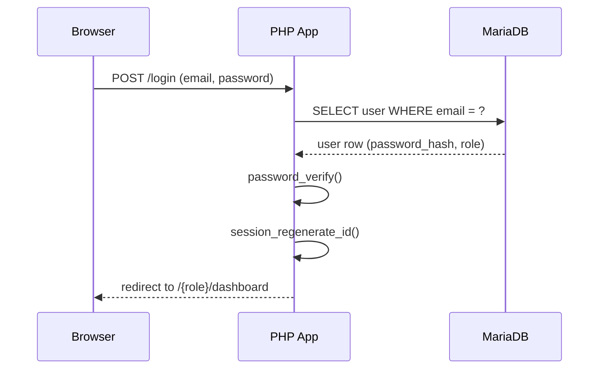
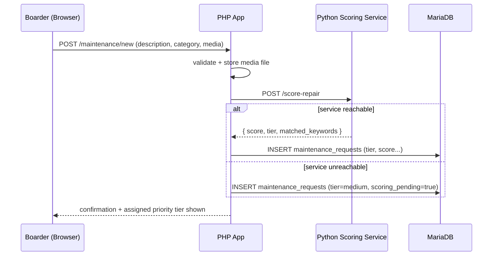
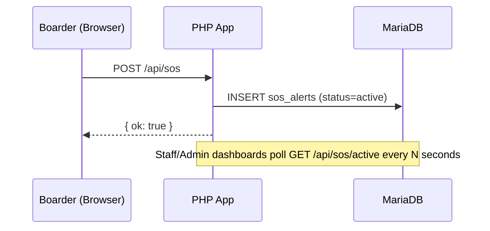
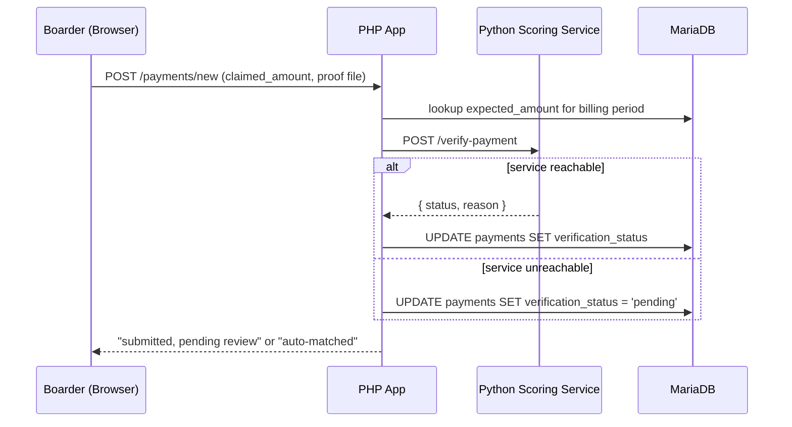
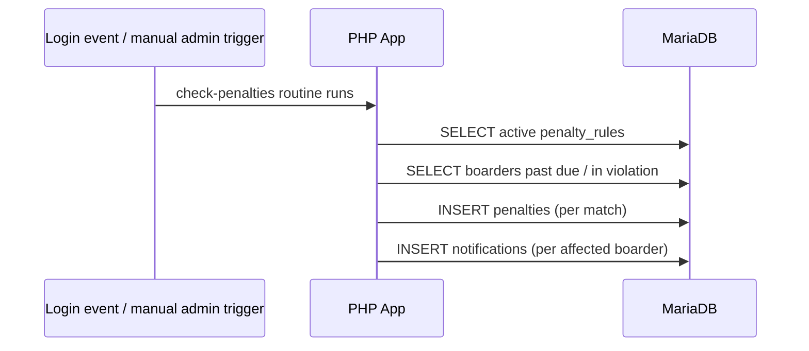
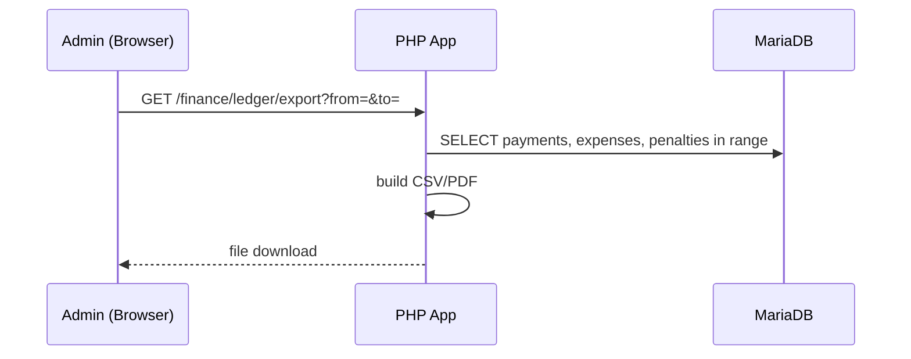
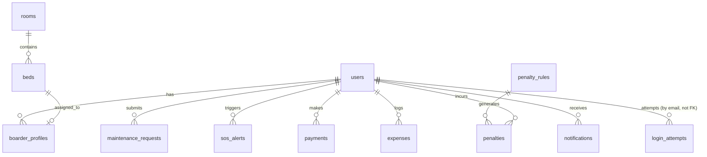

# RJM Boardinghouse — Architecture, Connectors & Flow Blueprint
### Companion to `CLAUDE.md` — feed this to Claude Code as the architecture/design planning pass, before Phase 1 coding begins

> **How to use this file**
> This is a *design-precision* document, not a feature list (that's `CLAUDE.md`). Paste it in as: *"Read CLAUDE.md and ARCHITECTURE.md. Before writing any Phase 1 code, confirm you understand every connector contract and flow below, flag anything ambiguous, then produce the folder scaffolding for Phase 0."*
> Treat every JSON contract and diagram here as **binding** unless you and the user explicitly change it — and if you do change one, edit it here so the doc stays the single source of truth, rather than letting the code and the doc drift apart.

---

## 1. Context View — who touches the system, and what's outside it

```
        ┌─────────────┐      ┌─────────────┐      ┌─────────────┐
        │    Admin    │      │Maint. Staff │      │   Boarder   │
        │   / Owner   │      │             │      │  / Tenant   │
        └──────┬──────┘      └──────┬──────┘      └──────┬──────┘
               │                    │                    │
               └────────────────────┼────────────────────┘
                                     ▼
                    ┌───────────────────────────────┐
                    │   RJM Boardinghouse System     │
                    │   (single machine, localhost)  │
                    └───────────────────────────────┘
```

- **No external systems.** No payment gateway, no SMS/email provider, no cloud storage, no third-party AI API. Everything the diagram would normally call "external" is either simulated locally or explicitly out of scope. If this ever changes, it's a scope change to confirm with the user first, not something to add quietly.

---

## 2. Container View — the four components and nothing else

| # | Component | Tech | Runs at | Responsibility |
|---|---|---|---|---|
| 1 | **Browser client** | HTML/CSS/JS | user's machine | Renders UI, handles forms, client-side validation, polling for notifications/SOS |
| 2 | **PHP Web App** | PHP + Apache | `localhost:80` | **Single system of record.** Auth, sessions, RBAC, all CRUD, all writes to MariaDB, orchestrates calls to the Python service |
| 3 | **Python Scoring Service** | Flask/FastAPI | `localhost:5000` | **Stateless compute only** — repair-priority scoring, payment-verification check. No writes to MariaDB (see refinement note below), no session/auth logic of its own |
| 4 | **MariaDB** | MariaDB | `localhost:3306` | Sole datastore. Only the PHP app writes to it |

**Refinement over the earliest draft:** an initial version allowed the Python service to write to MariaDB directly. That creates two writers to the same tables and invites race conditions (e.g. PHP and Python both trying to update `maintenance_requests.priority_tier`). **The Python service is purely stateless**: PHP sends it data, it computes and returns a result, PHP is the only thing that persists anything. `CLAUDE.md` and `.claude/rules/python-conventions.md` already reflect this — this file is the reason why.

---

## 3. Connector Contracts

Every arrow in the diagrams below is a real, specified interface — not "and then it talks to the database somehow."

### 3.1 Browser ⟷ PHP App
- Protocol: standard HTTP(S), session cookie (`httponly`, `samesite=strict`) after login.
- Two request styles, used deliberately, not interchangeably:
  - **Full page loads** (form POST + redirect) for anything that changes state and isn't latency-sensitive: login, CRUD forms, ledger export.
  - **Small JSON/AJAX endpoints** only where the UI genuinely needs it without a full reload: notification bell polling (`GET /api/notifications/unread`), SOS button (`POST /api/sos`), live maintenance-queue refresh.
- Every state-changing request carries a CSRF token; every response either redirects with a flash message or returns a small `{ "ok": bool, "message": string }` JSON body — pick one shape per endpoint and keep it consistent.

### 3.2 PHP App ⟷ Python Scoring Service
Internal, `localhost`-only REST calls. PHP is the only caller; the Python service should refuse connections from anywhere but `127.0.0.1` as a basic guard.

**`POST /score-repair`**
```json
// Request
{
  "description": "string",
  "category": "electrical | plumbing | structural | appliance | other",
  "has_media": true,
  "hours_since_submission": 0
}
// Response 200
{
  "score": 0,
  "tier": "critical | high | medium | low",
  "matched_keywords": ["string"]
}
```
`matched_keywords` is returned so staff can see *why* something scored the way it did — don't make the score a black box.

**`POST /verify-payment`**
```json
// Request
{
  "expected_amount": 0.0,
  "claimed_amount": 0.0,
  "proof_filename": "string"
}
// Response 200
{
  "status": "auto-matched | flagged",
  "reason": "string"
}
```

**Failure mode (be explicit about this, don't hand-wave it):**
- PHP calls with a short timeout (e.g. 3s).
- If `/score-repair` is unreachable or errors: store the request anyway with `priority_tier = "medium"` and a `scoring_pending = true` flag, and show staff a visible "not yet AI-scored" badge. Give admins a manual "rescore" action rather than relying on a cron job that may not exist in a localhost dev setup.
- If `/verify-payment` is unreachable or errors: set `verification_status = "pending"` and require manual admin review. **Never auto-approve a payment because the checker was unavailable** — fail closed, not open.

### 3.3 PHP App ⟷ MariaDB
- PDO only, prepared statements only, no string-concatenated SQL anywhere — this is a hard rule, not a style preference.
- One connection helper (e.g. `Database::getConnection()`), reused everywhere — not a new `new PDO(...)` scattered per file.
- Every table from the ER diagram in §7 below is written to by PHP alone.

---

## 4. Core Flows (sequence diagrams)

### 4.1 Login


### 4.2 Submit Repair Request (with scoring)


### 4.3 Emergency SOS


### 4.4 Proof of Payment Upload & Verification


### 4.5 Penalty Auto-Application

No real cron guarantee on a localhost dev box — trigger this check on admin login and/or a manual "run penalty check" admin button, not a background daemon you can't guarantee is running during a demo.

### 4.6 Ledger Export


---

## 5. PHP Application Design

```
/public/                 ← web root (only entry point Apache serves)
  index.php
  assets/ (css, js)
  uploads/                ← validated media/receipts land here, never web-executable
/src/
  Controllers/            ← one per resource: AuthController, MaintenanceController, ...
  Models/                 ← thin DB-access classes, one per table
  Services/               ← e.g. ScoringClient.php (wraps calls to the Python service), LedgerBuilder.php
  Middleware/              ← auth check, role check, CSRF check — run before controller logic, not duplicated in each controller
  Database.php             ← single PDO connection helper
/config/
  .env                     ← DB creds, service URLs/ports — never hardcoded, never committed
/database/
  migrations/               ← one file per table, applied in order
```

- Controllers stay thin: validate input → call a Model/Service → return a view or JSON. Business logic (penalty rules, ledger assembly) lives in `Services/`, not inline in controllers.
- RBAC is enforced once, in `Middleware/`, keyed off the session's role — not re-implemented per page.

## 6. Python Service Design

```
/scoring_service/
  main.py                  ← Flask/FastAPI app, route definitions only
  scoring.py                ← the weighted-rule logic from FEATURES.md §1
  verification.py           ← the amount-matching logic from FEATURES.md §7
  requirements.txt
```
- Stateless: no DB driver, no ORM, no session handling. Pure input → computed output.
- Validate incoming JSON against an explicit schema (Pydantic if FastAPI) and return a clear 400 with a message if malformed — don't let a bad request 500 silently.
- Bind to `127.0.0.1` only, never `0.0.0.0` — this service should be unreachable from outside the machine.

## 7. Database Conventions
- Snake_case, plural table names: `users`, `rooms`, `payments`... (see the ER diagram immediately below).
- Every table: `id` PK auto-increment, `created_at` default-now timestamp.
- Foreign keys named `<singular_table>_id` (e.g. `boarder_id` → `users.id`), with actual FK constraints declared — not just implied by naming.
- Index anything filtered/sorted on a queue or dashboard: `maintenance_requests(priority_tier, status)`, `sos_alerts(status)`, `payments(verification_status)`.



## 8. Frontend Page Map & Flow

| Role | Landing page | Key pages |
|---|---|---|
| Admin | `/admin/dashboard` (Command Center) | boarders, rooms/beds, maintenance queue, finance (payments/expenses/ledger/penalty rules), incidents, occupancy trend |
| Staff | `/staff/maintenance` (priority queue) | incidents, SOS monitor |
| Boarder | `/portal/dashboard` | new maintenance request, SOS button, payments/proof upload, notifications |

- One shared layout shell; nav items rendered conditionally by role, not three separate templates.
- Define loading / empty / error states per page up front (e.g. maintenance queue empty state = "No open requests — nice job," not a blank table) — treat these as design decisions now, not afterthoughts during Phase 8 polish.
- **Styling and motion:** Tailwind CSS (utility CSS, loaded via CDN/CLI, no build pipeline) for the design system; GSAP (free as of April 2025, including all plugins) for animation — SOS pulse, dashboard reveal-on-scroll via `ScrollTrigger`, priority-badge transitions. Both are framework-agnostic and require no React/Vite adoption. Full evaluation and rejected alternatives: `UI-LIBRARY-EVALUATION.md`. Respect `prefers-reduced-motion` (GSAP's `matchMedia()` helper) as part of the accessibility floor below.

## 9. Cross-Cutting Conventions
- Config via `.env`, loaded once, never hardcoded ports/paths in controllers.
- Logging: `/logs/app.log` (PHP) and `/logs/scoring_service.log` (Python), each line timestamped with a level (INFO/WARN/ERROR).
- Consistent error shape from the Python service: `{ "error": { "code": "...", "message": "..." } }`, so PHP has one thing to check for, not per-endpoint ad hoc error handling.
- Security recap (ties back to `CLAUDE.md`'s non-negotiable constraints and hard rules): password hashing, PDO prepared statements, CSRF tokens, session regeneration on login, upload validation — all enforced at the layer boundaries defined above, not scattered ad hoc. The `.claude/agents/security-reviewer.md` subagent checks these at the end of any phase that touches them.

---

## 10. Architecture-Phase Deliverables Checklist
Before starting `PHASES.md` Phase 1, Claude Code should be able to show:
- [ ] This document reviewed, with any changed decisions edited back into it (not left to drift from the code)
- [ ] Folder scaffolding for both the PHP app and Python service created, matching §5/§6 above
- [ ] `.env.example` with every required variable listed (DB creds, service port, upload path)
- [ ] The two Python endpoint contracts implemented as stubs that return valid dummy responses (proves the connector works end-to-end before real logic is written)
- [ ] `.claude/settings.json` hooks and `.claude/rules/*.md` in place and confirmed loaded (`/context` in Claude Code should list them)
